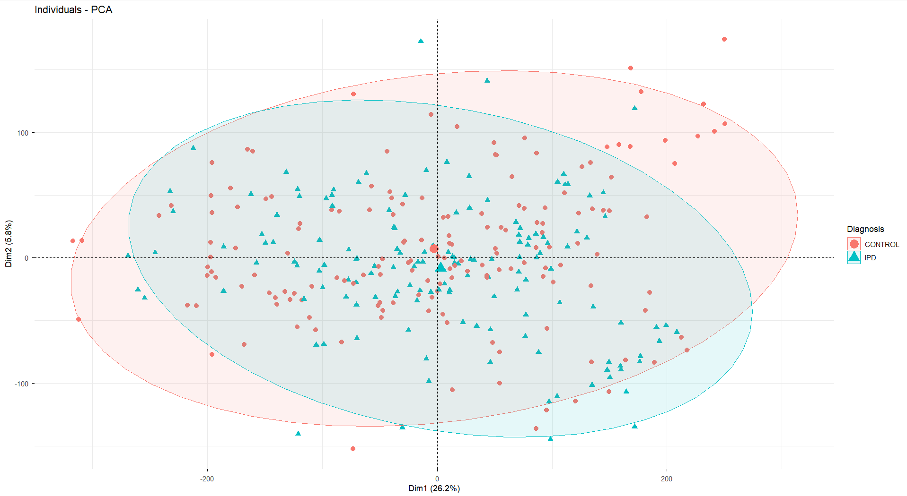
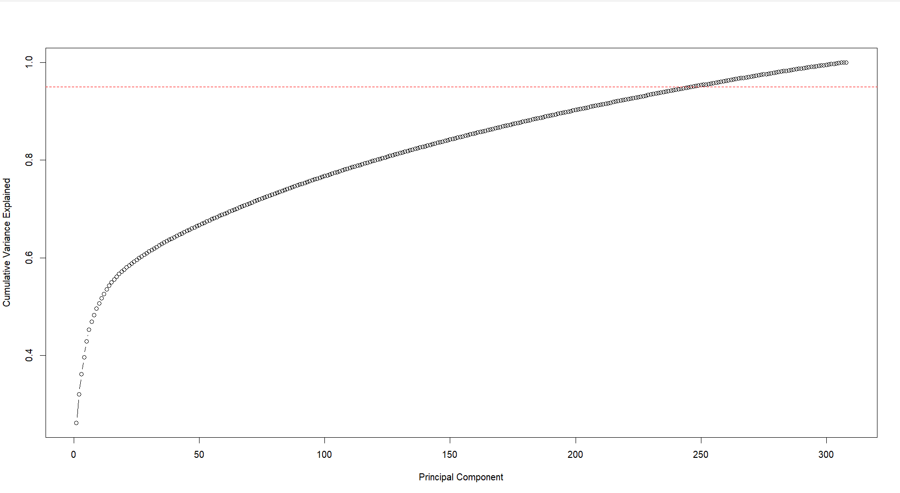
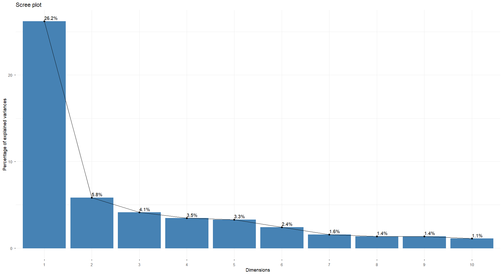
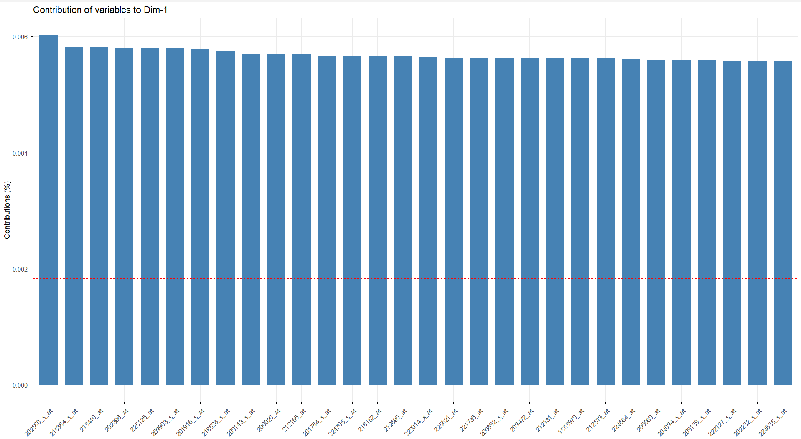
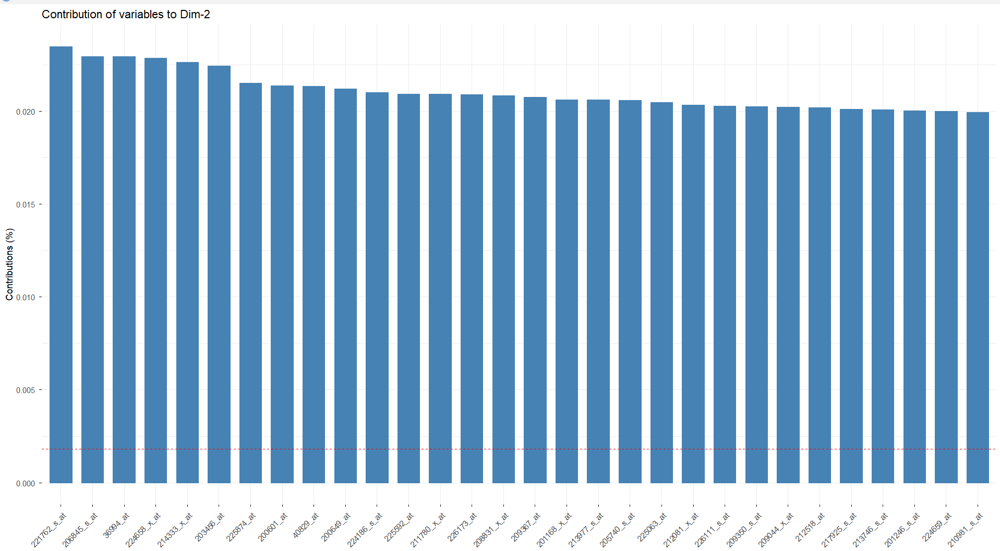
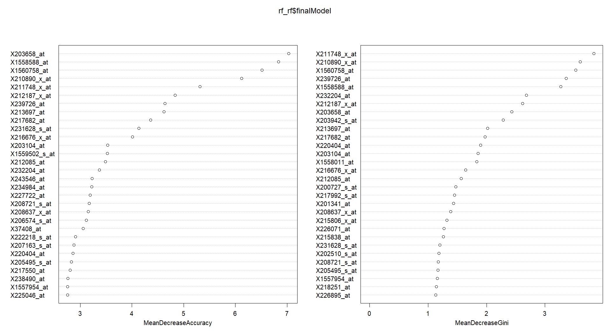
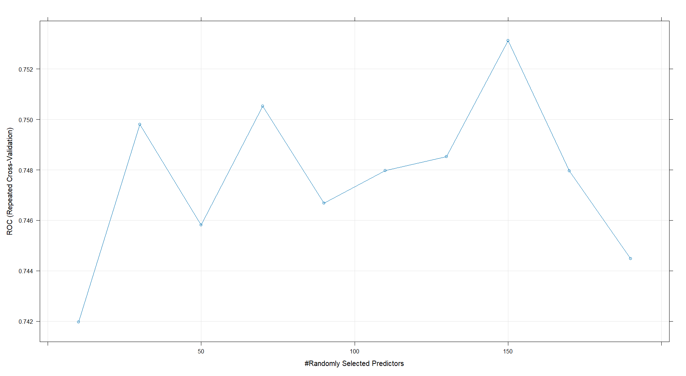

# Parkinson's Disease Classification Using Blood DNA Methylation Data

An end-to-end machine learning workflow for classifying Parkinson's disease using whole-blood Gene Expression microarray data from the Gene Expression Omnibus (GEO).

---

# Project Overview

Parkinson's disease (PD) is a progressive neurodegenerative disorder for which reliable molecular biomarkers are still being actively investigated. Gene expression profiling has emerged as a valuable approach for identifying transcriptional changes associated with disease and for discovering potential diagnostic biomarkers.

This project develops and evaluates machine learning models for Parkinson's disease classification using genome-wide whole-blood gene expression microarray data obtained from the Gene Expression Omnibus (GEO). Multiple preprocessing strategies, feature engineering approaches, and machine learning algorithms were systematically compared using repeated cross-validation before evaluating the best-performing model on an independent hold-out test set.

The primary objective was to construct a reproducible machine learning workflow while minimizing information leakage and following sound machine learning practices.

---

# Dataset

**Source**

Gene Expression Omnibus (GEO)

**Accession**

GSE99039

**Data Type**

Whole-blood Gene Expression Microarray

**Classes**

- Idiopathic Parkinson's Disease (IPD)
- Healthy Controls (CONTROL)

**Raw Data Availability**

The raw expression matrix is not included in this repository due to size limitations.

It is available for download here:

https://drive.google.com/file/d/1prLaCVg56-_QhqqIVdCQKAph1AzdeCKk/view?usp=sharing

File name:
GSE99039_series_matrix.txt

After downloading, place the file in the following directory:

data/

---

# Saved Models

The trained model objects are not stored in this repository due to file size constraints.

They are available here:

https://drive.google.com/file/d/15jgeavQbZKR21vPrNi_VsHwxpAjJxCef/view?usp=sharing

File name:
ml_pipeline_objects.rds

These objects include:
- Trained Random Forest model
- Feature selection outputs
- PCA transformation objects
- Preprocessing pipeline components

---

# Objectives

- Build an end-to-end machine learning workflow for methylation data.
- Compare feature selection and dimensionality reduction approaches.
- Compare multiple classification algorithms.
- Prevent information leakage through appropriate preprocessing.
- Evaluate models using repeated cross-validation.
- Assess the best-performing model on an independent hold-out test set.
- Identify biologically informative methylation probes using Random Forest feature importance.

---

# Workflow

```text
                           GEO Dataset (GSE99039)
                                      │
                                      ▼
                    Import Expression Matrix & Metadata
                                      │
                                      ▼
                Remove Metadata & Extract Class Labels
                                      │
                                      ▼
           Stratified Train/Test Split (Performed First)
                                      │
             ┌────────────────────────┴────────────────────────┐
             │                                                 │
             ▼                                                 ▼

      Random Forest Feature Pipeline                  PCA Pipeline

             │                                                 │
      Median Imputation                             Median Imputation
             │                                                 │
      Near-Zero Variance Filter                      Zero Variance Filter
             │                                                 │
      Random Forest Feature Ranking                Feature Standardization
             │                                                 │
      Select Informative Probes                    Principal Component Analysis
                                                   (95% Explained Variance)
             │                                                 │
      Standardize Selected Features                Transform Test Set Using
                                                   Training PCA Parameters
             └────────────────────────┬────────────────────────┘
                                      ▼

                    Machine Learning Model Training

                 Repeated 10-Fold Cross Validation
                            (5 Repeats)

                                      │
                                      ▼

                    Hyperparameter Optimization

             • Logistic Regression
             • Random Forest
             • Support Vector Machine (RBF)

                                      │
                                      ▼

                    Model Performance Comparison

                                      │
                                      ▼

             Best Model Selected (Random Forest Pipeline)

                                      │
                                      ▼

          Independent Hold-Out Test Set Evaluation

 Accuracy • Sensitivity • Specificity • Precision • Recall
          F1-score • ROC Curve • ROC-AUC

                                      │
                                      ▼

          Random Forest Variable Importance Analysis

                                      │
                                      ▼

          Export Top Methylation Probes for
          Downstream Biological Interpretation
```

---

# Machine Learning Pipelines

## 1. Random Forest Feature Selection Pipeline

- Median imputation
- Near-zero variance filtering
- Random Forest feature importance
- Selection of informative methylation probes
- Feature standardization
- Logistic Regression
- Random Forest
- Support Vector Machine

## 2. Principal Component Analysis Pipeline

- Median imputation
- Near-zero variance filtering
- Feature standardization
- Principal Component Analysis (95% explained variance)
- Logistic Regression
- Random Forest
- Support Vector Machine
---

# Model Comparison

Two independent feature engineering pipelines were evaluated using three machine learning algorithms.

| Pipeline | Model | Cross-Validation ROC-AUC |
|-----------|-------|-------------------------:|
| Random Forest Features | Logistic Regression | 0.657 |
| Random Forest Features | Random Forest | **0.753** |
| Random Forest Features | Support Vector Machine (RBF) | 0.737 |
| PCA | Logistic Regression | 0.539 |
| PCA | Random Forest | 0.653 |
| PCA | Support Vector Machine (RBF) | 0.651 |

The Random Forest feature selection pipeline consistently outperformed the PCA pipeline. Among all evaluated models, the Random Forest classifier trained on Random Forest-selected features achieved the highest cross-validation ROC-AUC and was therefore selected for independent test set evaluation.

---

# Final Model Evaluation

The best-performing model was evaluated on an independent hold-out test set that remained completely unseen during preprocessing, feature selection, hyperparameter tuning and model training.

Performance was assessed using:

- Accuracy
- Sensitivity (Recall)
- Specificity
- Precision
- F1-score
- ROC Curve
- ROC-AUC

The Random Forest classifier achieved a test ROC-AUC of approximately **0.7**. Although the performance was modest, the evaluation remains unbiased because all preprocessing, feature selection and model tuning were performed exclusively on the training data, preventing information leakage.

---

# Visualizations

## PCA Projection



---

## Cumulative Variance Explained with 95% Confidence 



---

## PCA Scree Plot




---

## Principal Component 1 Variable Contributions



---

## Principal Component 2 Variable Contributions




---

## Random Forest Variable Importance


---

## Random Forest Hyperparameter Tuning



---

## ROC Curve of the Final Model


# Repository Structure

# Repository Structure

```text
GSE/
│
├── README.md
├── LICENSE
├── .gitignore
├── sessionInfo.txt
├── GSE.Rproj
│
├── data/
│   └── (raw dataset not included - download from Google Drive)
│
├── scripts/
│   ├── 01_data_loading.R
│   ├── 02_preprocessing.R
│   ├── 03_test_set_transformation.R
│   ├── 04_model_training.R
│   ├── 05_model_interpretation.R
│   └── 06_model_evaluation.R
│
├── figures/
│   ├── Best_Model_VarImpPlot.png
│   ├── ChosenModel_TuningPlot.png
│   ├── Cumulative_Variance.png
│   ├── PC1_Contribution_Plot.png
│   ├── PC2_Contribution_Plot.png
│   ├── PCA1vsPCA2.png
│   ├── ROC Curve.png
│   └── Scree_Plot.png
│
├── models/
│   └── (trained model objects not included - available via Google Drive)
│
└── results/
    ├── Confusion_Matrix_RF.csv
    ├── Model_Comparison_Table.xlsx
    ├── RF_Test_Metrics.csv
    ├── Top_PC1_Genes.csv
    ├── Top_pc2_Genes.csv
    └── top_probes.csv
```

# Software and Packages

## Programming Language

- R 4.5.1

## Primary Packages

- caret
- randomForest
- kernlab
- pROC
- ggplot2
- factoextra
- tidyverse

Complete package versions and session information are available in **sessionInfo.txt**.

---

# Future Work

Potential extensions of this project include:

- Mapping the most informative methylation probes to genes.
- Gene Ontology (GO) enrichment analysis.
- KEGG pathway enrichment analysis.
- Validation using an external Parkinson's disease methylation dataset.
- Comparison with additional machine learning algorithms such as XGBoost and LightGBM.
- Integration with transcriptomic or other multi-omics datasets.

---

# Reproducibility

All preprocessing, feature engineering, model training, and evaluation steps are fully reproducible using the provided scripts.

The workflow assumes that the raw dataset is downloaded separately due to size constraints.

---

# Setup Instructions

1. Clone this repository
2. Download the raw dataset from Google Drive
3. Place the file in the `data/` folder
4. Open the R project file (`GSE.Rproj`)
5. Run scripts in order starting from:

   01_data_loading.R

---

# Acknowledgements

The Gene Expression dataset used in this study was obtained from the Gene Expression Omnibus (GEO) under accession **GSE99039**. The authors of the original dataset are acknowledged for making the data publicly available.

---

# Author

**M. Archith Raj**

Bioinformatics • Machine Learning • Computational Biology

---

# License

This project is distributed under the MIT License.